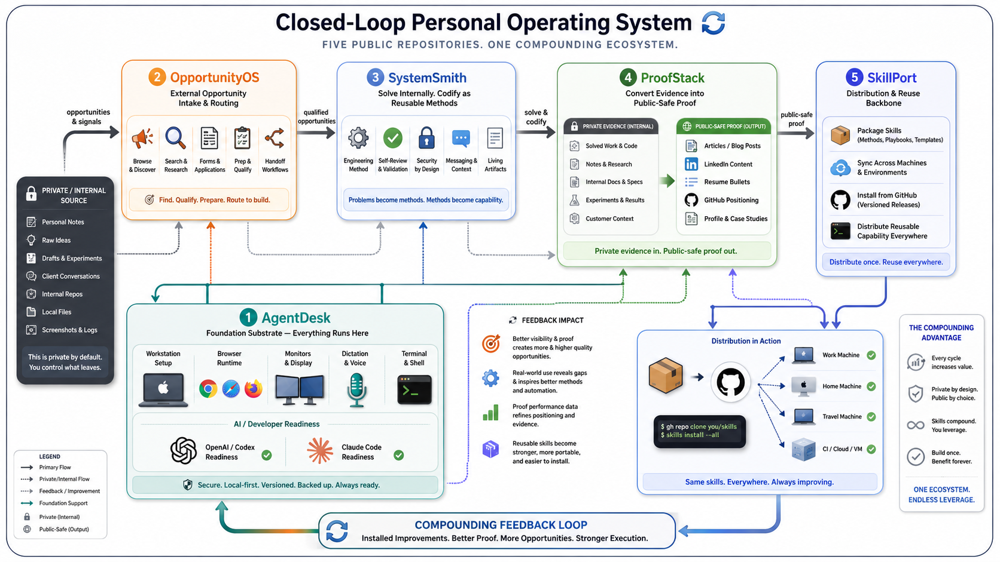

# Hi, I'm Arthur

I build practical automation systems for browser-heavy workflows, AI-agent workstations, engineering methods, and public-safe career proof.

My GitHub is organized as a closed-loop operating system I call LoopStack: set up the machine, capture opportunities, solve problems, turn the result into proof, and distribute the reusable parts back across machines.

## Start Here

- **[AgentDesk](https://github.com/ArthurZakirov/AgentDesk)** - workstation substrate for human + AI collaboration.
- **[OpportunityOS](https://github.com/ArthurZakirov/OpportunityOS)** - external opportunity intake and routing for browser-heavy workflows.
- **[SystemSmith](https://github.com/ArthurZakirov/SystemSmith)** - engineering methods for code, agents, docs, security, and architecture.
- **[ProofStack](https://github.com/ArthurZakirov/ProofStack)** - public-safe career proof, positioning, and writing systems.
- **[SkillPort](https://github.com/ArthurZakirov/SkillPort)** - packaging and distribution backbone for reusable skills across machines and repos.
- **[Website / blog](https://arthur-zakirov.vercel.app)** - public writing, case studies, and portfolio material.

## Current Focus

- Making the loop explicit so each repo has one job and one audience.
- Turning solved work into reusable skills that sync across machines.
- Keeping the public layer safe to share while preserving enough proof to be credible.

## Writing

- **[Website / blog](https://arthur-zakirov.vercel.app/blog)** - public-safe articles, notes, and project context.

## Background

- Data/AI engineer oriented toward practical systems and automation.
- Public projects are the visible layer; private employer work stays private.

## Connect

[Website](https://arthur-zakirov.vercel.app) · [LinkedIn](https://www.linkedin.com/in/arthurzakirov/) · [GitHub](https://github.com/ArthurZakirov)
